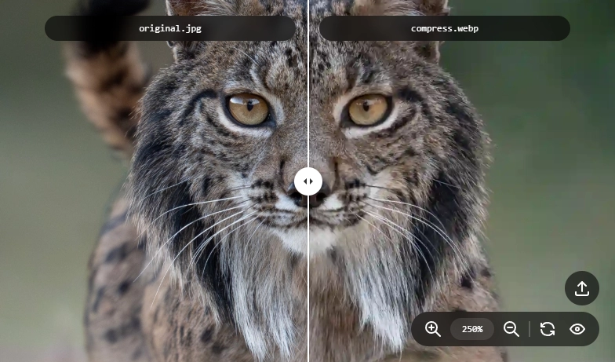

# Visual Diff

<p align="center">
  
</p>

<p align="center">
  <a href="https://www.instagram.com/angeliyo_o" target="_blank">Image by angeliyo_o</a>
</p>

<p align="center">
  <a href="#english">English</a> | <a href="#español">Español</a>
</p>

## English

### Description

Visual Diff is a desktop application built with **Electron** + **Vue 3** that allows you to visually compare two images or two videos side-by-side. It provides an interactive slider to reveal differences between the files, making it easy to spot changes, variations, or discrepancies.

- 🖼️ **Image Comparison**: Compare two images of the same aspect ratio
- 🎥 **Video Comparison**: Compare two videos with matching aspect ratio, duration, and frame count
- 🔍 **Interactive Slider**: Drag to reveal differences between files
- 🎬 **Video Controls**: Play, pause, and navigate frame-by-frame
- 🔎 **Zoom & Pan**: Zoom in/out and pan across images/videos
- 👁️ **Toggle View**: Show/hide the second file for easier comparison
- 📁 **File Selection**: Easy file selection with validation

### Commands

| Command | Description |
|---------|-------------|
| `pnpm start` | Start the application in development mode with hot-reload |
| `pnpm package` | Package the application for distribution |
| `pnpm make` | Build distributable packages (installers) for the current platform |
| `pnpm publish` | Publish the application to configured distribution channels |

### Requirements

- Node.js (v22 or higher recommended)
- pnpm package manager

### Installation

```bash
# Install dependencies
pnpm install

# Start the application
pnpm start
```

### Building

```bash
# Create distributable package
pnpm make
```

---

## Español

### Descripción

Visual Diff es una aplicación de escritorio desarrollada con **Electron** + **Vue 3** que permite comparar visualmente dos imágenes o dos videos lado a lado. Proporciona un control deslizante interactivo para revelar las diferencias entre los archivos, facilitando la detección de cambios, variaciones o discrepancias.

- 🖼️ **Comparación de Imágenes**: Compara dos imágenes con el mismo aspect ratio
- 🎥 **Comparación de Videos**: Compara dos videos con aspect ratio, duración y número de frames coincidentes
- 🔍 **Control Deslizante Interactivo**: Arrastra para revelar diferencias entre archivos
- 🎬 **Controles de Video**: Reproduce, pausa y navega frame por frame
- 🔎 **Zoom y Paneo**: Acerca/aleja y desplázate por las imágenes/videos
- 👁️ **Alternar Vista**: Muestra/oculta el segundo archivo para una comparación más fácil
- 📁 **Selección de Archivos**: Selección sencilla de archivos con validación

### Comandos

| Comando | Descripción |
|---------|-------------|
| `pnpm start` | Inicia la aplicación en modo desarrollo con recarga automática |
| `pnpm package` | Empaqueta la aplicación para distribución |
| `pnpm make` | Construye paquetes distribuibles (instaladores) para la plataforma actual |
| `pnpm publish` | Publica la aplicación en los canales de distribución configurados |

### Requisitos

- Node.js (v22 o superior recomendado)
- Gestor de paquetes pnpm

### Instalación

```bash
# Instalar dependencias
pnpm install

# Iniciar la aplicación
pnpm start
```

### Compilación

```bash
# Crear paquete distribuible
pnpm make
```
